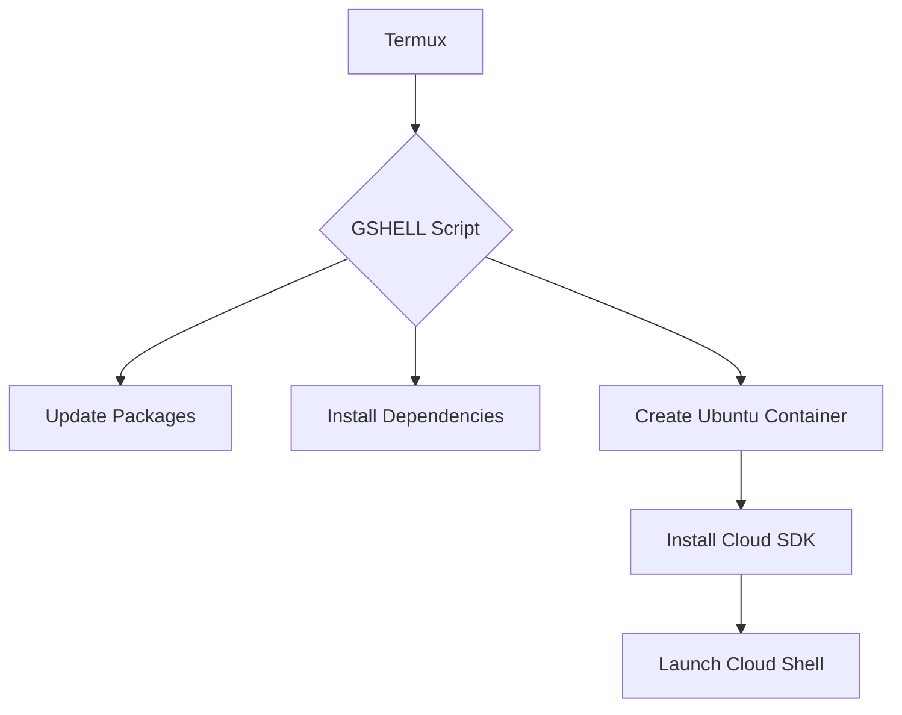

###GSHELL is a Bash script specifically crafted to bring Google Cloud Shell to your Termux environment. It automates the ###entire installation process by:

Preparing Your Environment: Automatically updating Termux packages and installing essential dependencies.

Deploying an Isolated Ubuntu Container: Using proot-distro, GSHELL sets up a secure Ubuntu container, ensuring that the installation of the Google Cloud SDK remains isolated from your main Termux setup.

Installing the Google Cloud SDK: Inside the container, the script installs and configures the Google Cloud SDK, enabling you to launch and use Google Cloud Shell directly on your device.

Interactive User Experience: Enjoy real-time progress updates with animated spinners and dynamic progress bars that guide you through the setup.

Quick Access Option: Use the -direct flag to bypass the initial setup steps and immediately jump into Google Cloud Shell when needed.


```markdown
# GSHELL ☁️  

 
*(Replace with actual demo GIF showing installation and usage)*

A seamless bridge between Termux and Google Cloud Shell 🔄

[](https://opensource.org/licenses/MIT)
[](https://github.com/ShreyashVaidya11/termux-cloudshell-setup/pulls)


## 🌟 Features

- **One-Click Setup**  
    
  Fully automated environment configuration

- **Secure Containerization**  
  🛡️ Isolated Ubuntu environment using proot-distro

- **Cloud Power in Your Pocket**  
  📱 Access Google Cloud SDK directly from mobile

- **Interactive UI**  
    
  Real-time progress indicators and visual feedback

## 🚀 Quick Start

### Prerequisites
- Android Device (7.0+ recommended)
- Termux App ([Download from F-Droid](https://f-droid.org/en/packages/com.termux/))

### Installation

```bash
# Clone repository
git clone https://github.com/ShreyashVaidya11/termux-cloudshell-setup.git

# Navigate to directory
cd gshell

# Make script executable
chmod +x gshell.sh

### Full installation
```bash
./gshell.sh
```

### Direct Access
```bash
./gshell.sh -direct
```
## 🖼️ Screenshots

| Installation Process | Cloud Shell Access |
|----------------------|--------------------|
|  |  |

## 📂 Project Structure
```
gshell/
├── assets/
│   ├── demo.gif
│   ├── screenshot1.png
│   └── screenshot2.png
├── gshell.sh
├── LICENSE
└── README.md
```

## 🛠️ Technical Overview



## 🤝 Contributing

Contributions are welcome! Please follow our [contribution guidelines](CONTRIBUTING.md).

## 📄 License

This project is licensed under the MIT License - see the [LICENSE](LICENSE) file for details.

```

**Recommendations for Visuals:**

1. **Demo GIF:**  
   Create a screen recording showing:
   - Script execution process
   - Ubuntu container setup
   - Cloud SDK installation
   - Successful launch of Cloud Shell

2. **Screenshots:**
   - Termux package update progress
   - proot-distro container creation
   - gcloud initialization screen
   - Active Cloud Shell session

3. **Badges:**  
   Add real badges from [shields.io](https://shields.io) for:
   - Android version compatibility
   - Termux package version
   - Last commit status

4. **Diagram:**  
   Create a proper mermaid diagram or architecture flowchart

**Tools to Create Visuals:**
- **Termux Screenshots:** Use Termux:Widget for easier screenshot capture
- **Screen Recording:** Use AZ Screen Recorder (Android)
- **GIF Creation:** Use ScreenToGif or LICEcap
- **Diagramming:** Draw.io or Excalidraw
