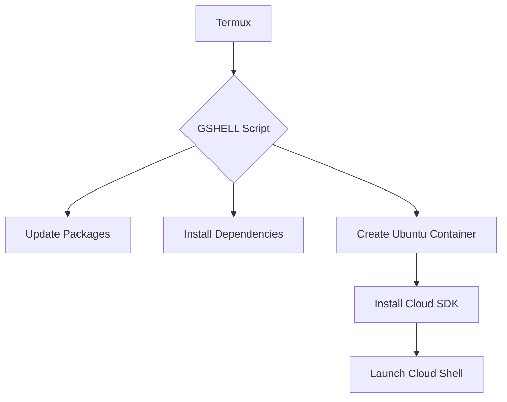

# GSHELL ☁️  

 


A seamless bridge between Termux and Google Cloud Shell 🔄

[](https://opensource.org/licenses/MIT)
[](https://github.com/ShreyashVaidya11/termux-cloudshell-setup/pulls)
[](https://www.gnu.org/software/bash/)
## 🌟 Features

- **One-Click Setup**  
    
  Fully automated environment configuration

- **Secure Containerization**  
  🛡️ Isolated Ubuntu environment using proot-distro

- **Cloud Power in Your Pocket**  
  📱 Access Google Cloud SDK directly from mobile

- **Interactive UI**  
    
  Real-time progress indicators and visual feedback

## 🚀 Quick Start

### Prerequisites
- Android Device (7.0+ recommended)
- Termux App ([Download from F-Droid](https://f-droid.org/en/packages/com.termux/))

### Installation

```bash
# Clone repository
git clone https://github.com/ShreyashVaidya11/termux-cloudshell-setup.git

# Navigate to directory
cd gshell

# Make script executable
chmod +x gshell.sh

# Full installation
./gshell.sh
```

### Direct Access
```bash
./gshell.sh -direct
```


## 📂 Project Structure
```
gshell/
├── assets/
│   ├── demo.gif
│   ├── screenshot1.png
│   └── screenshot2.png
├── gshell.sh
├── LICENSE
└── README.md
```

## 🛠️ Technical Overview



## 🤝 Contributing

Contributions are welcome! Please follow our [contribution guidelines](CONTRIBUTING.md).

